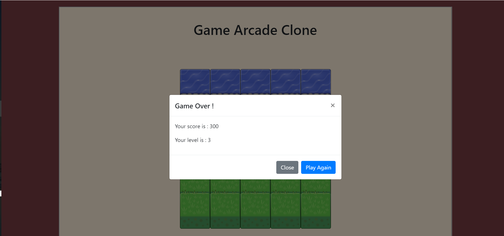

# frontend-nanodegree-arcade-game

## Project Rubric Criterias
#### Error Free
Player can not move off screen
Vehicles cross the screen
Vehicle-player collisions happen logically (not too early or too late)
Vehicle-player collision resets the game
Something happens when player wins
A Bootstrap modal is used when the game is over

  

#### Object Oriented Code
Game objects (player and vehicles) are implemented using JavaScript object-oriented programming features.

## Built With
In this project;

* [Bootstrap modal plugin](https://getbootstrap.com/docs/4.0/components/modal/) had been used for creating a slide down modal at the end of the game. 

## Game Play
The game starts after user changes his/her player character, aim of the game is reaching as  highest level and score as possible. 
The player should avoid enemies and reach to the last line to gain a level and also this increments his/her score. 
Movement is handling by arrow keys.
By passing a level three different gemstones and a heart appears on canvas randomly, to collect these gemstones means extra score points to the player and also to collect hearts incrementing lives by one (limited to six lives maximum).
By passing a level increases enemy speed by 10% to increase complexity but after level ten a star image randomly appear on canvas to reset enemy speed back to 50, so user should have a chance to get higher level and score.

## Authors
* Richard Kalehoff 
* Ozkan Abdullahoglu
